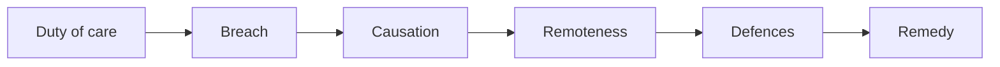

# Law conversion revision hub

My revision system for the PGDL at the University of Law: interactive chapter posters, flashcard decks, structured notes with flowcharts, and problem-question templates that improve with each round of tutor feedback.

**New here? Read [START-HERE.md](START-HERE.md).**

## What's inside

| Folder | What it holds |
|---|---|
| [`posters/`](posters/) | Interactive HTML revision posters, one folder per module |
| [`flashcards/`](flashcards/) | Flashcard decks as `Question,Answer` CSV files (also import into Anki and Quizlet) |
| [`notes/`](notes/) | Chapter notes in Markdown: term, plain-English explanation, cases, worked example |
| [`templates/`](templates/) | Chapter, case-note and problem-question templates |
| [`career/`](career/) | Commercial-awareness explainers |
| `index.html` | The revision hub website |

## How a claim in negligence works

GitHub draws flowcharts written in plain text. This one is written in a few lines of Markdown; see [notes/tort/negligence-map.md](notes/tort/negligence-map.md) for the full version with cases.

