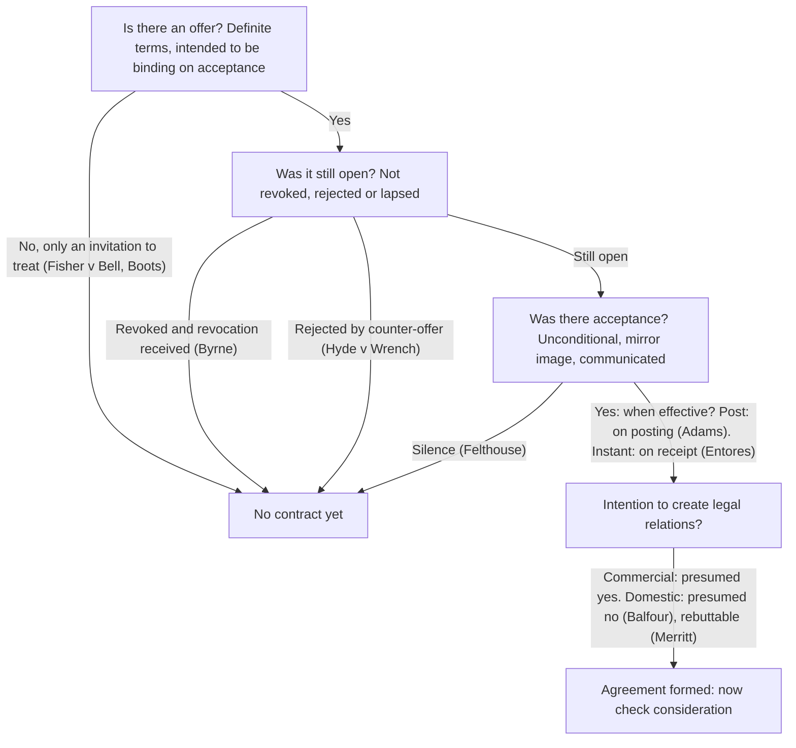

# Chapter 1: Agreement and contractual intention

> **ELI5:** A contract is a promise the law will enforce. For one to exist you need a clear **offer**, an unconditional **acceptance** of exactly that offer, and an intention by both sides that the deal should be **legally binding**. (Consideration comes in Chapter 2.)

---

## Offer

**Offer** — a definite statement of terms made with the intention of being bound as soon as it is accepted.
> **ELI5:** "I'll sell you my bike for £50" said seriously. If you say "yes", the deal is done; the offeror has nothing left to decide.

**Invitation to treat** — an invitation for others to make offers.
> **ELI5:** A shop window is like a menu: it tells you what's available, but *you* make the offer when you order.

- **Fisher v Bell [1961]** — a shopkeeper displayed a flick knife with a price ticket in his window and was charged with "offering it for sale". A display is only an invitation to treat, so he was not guilty.
- **Pharmaceutical Society of GB v Boots Cash Chemists [1953]** — Boots let customers take medicines from self-service shelves; the law required sales to be supervised by a pharmacist. Goods on shelves are an invitation to treat; the customer offers at the till, where a pharmacist accepts. No offence.
- **Carlill v Carbolic Smoke Ball Co [1893]** — the company advertised £100 to anyone who used its smoke ball correctly and still caught flu, and said it had deposited £1,000 with a bank to show sincerity. Mrs Carlill did so and caught flu. The advert was a **unilateral offer to the world**, accepted by performing the conditions.

## Ending an offer

**Revocation** — the offeror withdraws the offer. It takes effect only when **communicated**.
- **Byrne v Van Tienhoven (1880)** — a revocation letter arrived after the offeree had already telegraphed acceptance. The postal rule doesn't apply to revocations, so a contract had been formed.

**Counter-offer** — a response that changes the terms; it **rejects** the original offer.
- **Hyde v Wrench (1840)** — Wrench offered his farm for £1,000; Hyde offered £950, which was refused, then tried to accept at £1,000. The counter-offer had destroyed the original offer: no contract.
- **Stevenson, Jacques & Co v McLean (1880)** — asking whether delivery could be spread over time was a **request for information**, not a counter-offer, so the offer survived.

## Acceptance

**Acceptance** — an unconditional agreement to all the terms of the offer, communicated to the offeror.
> **ELI5:** It's "yes" to the exact deal on the table. "Yes, but…" is not acceptance; it's a new offer.

- **Felthouse v Bindley (1862)** — an uncle wrote that if he heard nothing more he would consider his nephew's horse his. **Silence is not acceptance**: no contract.
- **Adams v Lindsell (1818)** — **postal rule:** where post is a reasonable way to accept, acceptance is complete when the letter is posted, even if delayed or lost.
- **Entores v Miles Far East Corp [1955]** — for instant communication (telex), acceptance takes effect when and where it is **received**.
- **Butler Machine Tool v Ex-Cell-O [1979]** — each side sent its own standard terms (**battle of the forms**). Each new form was a counter-offer; the contract was on the terms of the **last shot** before acceptance.

## Intention to create legal relations

**Intention to create legal relations** — both sides must intend the agreement to be legally enforceable.
> **ELI5:** Promising to cook your partner dinner isn't a contract; promising a supplier to pay £5,000 for stock is. The law uses presumptions to tell them apart.

- **Balfour v Balfour [1919]** — a husband working abroad promised his wife £30 a month; the payments stopped after they separated. Agreements between spouses living together are **presumed not** binding.
- **Merritt v Merritt [1970]** — after separating, a husband signed a note promising to transfer the house to his wife once she paid off the mortgage. The presumption was **rebutted**: the promise was enforceable.
- Commercial agreements are **presumed** binding; the presumption can be rebutted only by clear evidence.

---

## Worked example

*On Monday Sam emails Ana: "My laptop is yours for £400." On Tuesday Ana replies "£350?" Sam doesn't answer. On Wednesday Ana posts a letter: "OK, £400 it is."*

1. **Offer?** Definite terms, intended to bind: yes.
2. **Still open?** Ana's "£350?" changes the price, so it's a counter-offer that destroyed Sam's offer (*Hyde v Wrench*). If it had been "Would you take £350?" it might be a mere enquiry (*Stevenson v McLean*) — a point to argue.
3. **Acceptance?** If the offer died, Wednesday's letter is a **new offer**, so the postal rule doesn't help Ana (*Adams v Lindsell* applies only to acceptances).
4. **Conclusion:** probably no contract unless Sam accepts Ana's new offer.
