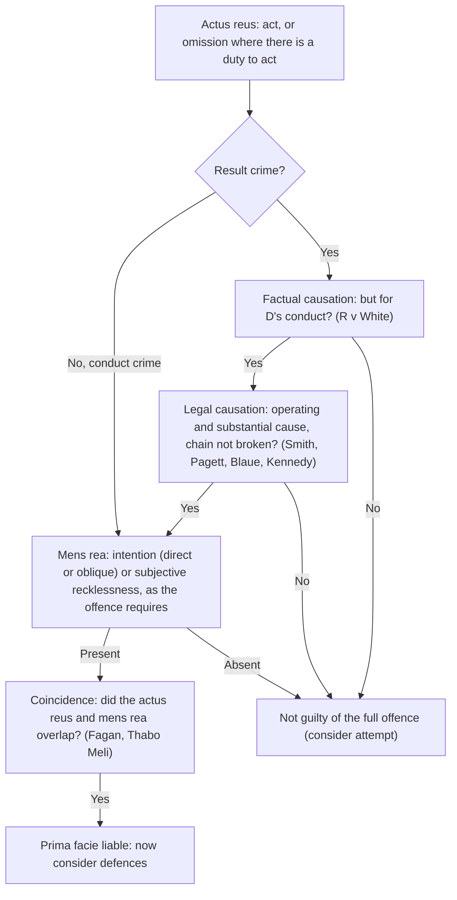

# Building criminal liability: actus reus, mens rea, causation

> **ELI5:** For most crimes the prosecution must prove two things: that D **did** the forbidden thing (the guilty act, *actus reus*) and that D had the right **state of mind** while doing it (the guilty mind, *mens rea*). The two must line up in time. If the crime needs a result, like a death, D's conduct must also have **caused** it.

*Actus non facit reum nisi mens sit rea* — "an act does not make a person guilty unless the mind is also guilty."

---

## Actus reus and omissions

**Actus reus** — the external elements of the offence: the conduct, any required circumstances, and any required result.
> **ELI5:** Everything about the crime you could film with a camera: what D did, the situation, and what happened as a result.

**Omission** — a failure to act. There is **no general duty** to act, so an omission only counts where D was under a legal duty.
> **ELI5:** Watching a stranger drown without helping is morally awful but usually not a crime. It becomes one only if the law had already made it *your job* to act.

Recognised duty situations, each with its case:
- **Contract** — **R v Pittwood (1902):** a railway gatekeeper left the crossing gate open while at lunch; a man crossing was hit by a train and killed. His employment contract created a duty to the public: manslaughter.
- **Voluntary assumption of care** — **R v Stone and Dobinson [1977]:** the pair took in Stone's anorexic sister, then failed to get help as she became seriously ill, and she died. Having taken on her care, they were guilty of manslaughter.
- **Creating a dangerous situation** — **R v Miller [1983]:** Miller fell asleep holding a lit cigarette, woke to a smouldering mattress, moved to another room and did nothing. Once aware of the danger he had created, he had a duty to act: arson.
- **Special relationship** — **R v Gibbins and Proctor (1918):** a father and his partner deliberately starved his daughter to death. A parent owes a duty to their child: murder.
- **Statute** — some offences are defined as failures, e.g. failing to provide a specimen.

## Causation

**Factual causation** — would the result have happened *but for* D's conduct?
- **R v White [1910]** — White poisoned his mother's drink to kill her, but she died of an unrelated heart attack before the poison worked. Not a but-for cause: guilty only of **attempted** murder.

**Legal causation** — D's conduct must be an **operating and substantial** cause, and no new intervening act (*novus actus interveniens*) must break the chain.
> **ELI5:** Picture a line of dominoes from D's act to the result. Legal causation asks whether something new and independent knocked the line over from the side and took over.

- **R v Smith [1959]** — a soldier was stabbed, dropped twice while being carried to treatment, and given poor treatment. The stab wound was still an operating and substantial cause: chain not broken. Treatment breaks the chain only if the original wound is merely "the setting".
- **R v Pagett (1983)** — Pagett used a pregnant 16-year-old as a human shield while shooting at police; they returned fire and killed her. Their reasonable self-defence did not break the chain: Pagett was liable.
- **R v Blaue [1975]** — Blaue stabbed a young woman who, as a Jehovah's Witness, refused a blood transfusion and died. **Thin skull rule:** take the victim as you find them, including their beliefs.
- **R v Kennedy (No 2) [2007]** — Kennedy prepared a heroin syringe and handed it to Bosque, who injected himself and died. A free, deliberate and informed act of a fully informed adult **breaks the chain**: not guilty of unlawful act manslaughter.

## Mens rea

**Direct intention** — D's aim or purpose is to bring about the result.
**Oblique (indirect) intention** — the result isn't D's aim, but D sees it as virtually certain.
> **ELI5:** Direct: you blow up a plane *to kill* the pilot. Oblique: you blow it up *to claim the insurance on the cargo*, knowing the pilot will certainly die. The law can treat both as intention.

- **R v Woollin [1999]** — Woollin, in a fit of temper, threw his three-month-old baby towards his pram near a wall; the baby died of a fractured skull. The jury may not find intention unless death or serious injury was a **virtual certainty** from D's actions **and D appreciated** that.

**Subjective recklessness** — D was aware of a risk and, in the circumstances known to D, it was unreasonable to take it.
> **ELI5:** "I knew it might go wrong and did it anyway." The question is what *D actually* realised, not what a sensible person would have realised.

- **R v Cunningham [1957]** — Cunningham tore a gas meter from a cellar wall to steal the money inside; gas seeped next door and affected his future mother-in-law. "Maliciously" requires intention or subjective foresight of the risk.
- **R v G [2003]** — two boys (11 and 12) set fire to newspapers behind a shop; the fire spread and caused about £1 million of damage. The House of Lords overruled the objective *Caldwell* test: recklessness is **subjective**.

## Coincidence

**Coincidence (contemporaneity)** — the actus reus and mens rea must exist at the same time.
- **Fagan v MPC [1969]** — Fagan accidentally drove onto a police officer's foot, then deliberately stayed there. It was a **continuing act**, so his later mens rea was enough: assault.
- **Thabo Meli v R [1954]** — the defendants beat a man intending to kill him, thought he was dead, and rolled him over a cliff; he died of exposure. The acts formed **one transaction**, so the initial mens rea covered the death.

---

## Worked example

*Dan shoves Eli in a pub, meaning to hurt him. Eli falls, hits his head and is taken to hospital, where doctors are slow to spot a bleed. Eli dies.*

1. **Actus reus:** Dan's shove is a positive act. This is a result crime (death), so check causation.
2. **Factual causation:** but for the shove, Eli wouldn't have hit his head. ✔ (contrast *White*)
3. **Legal causation:** slow diagnosis doesn't break the chain while the head injury is still an operating and substantial cause. ✔ (*Smith*)
4. **Mens rea:** "meaning to hurt him" — does it reach intention to kill or cause GBH (murder)? If not, consider unlawful act manslaughter.
5. **Coincidence:** intention existed at the moment of the shove. ✔
