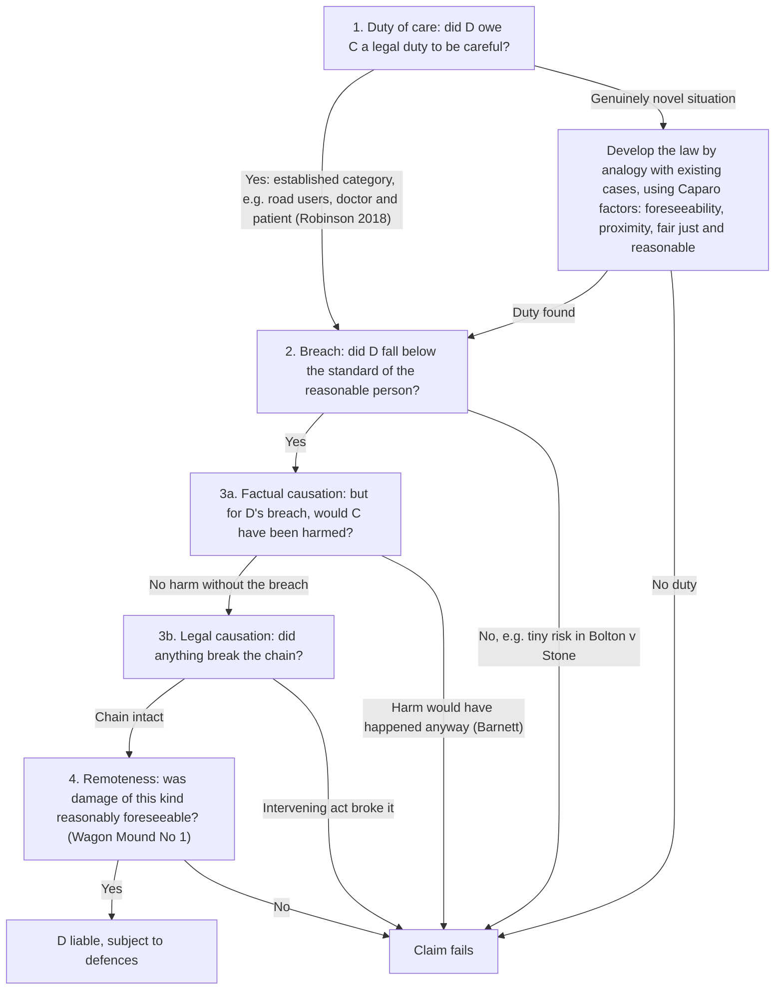

# Negligence: the whole route on one page

> **ELI5:** Negligence is the law's way of saying "you were careless, your carelessness hurt me, so you pay to put it right." To win, the injured person (the **claimant**) has to get through four gates in order. Fail any gate and the claim stops there.

---

## Gate 1 — Duty of care

**Duty of care** — a legal obligation to take reasonable care not to cause harm to someone.
> **ELI5:** Before you can be blamed for being careless towards someone, the law has to agree you were supposed to be looking out for them in the first place. A driver must look out for pedestrians; a stranger on a beach isn't legally obliged to rescue you.

- **Donoghue v Stevenson [1932]** — Mrs Donoghue's friend bought her a ginger beer in an opaque bottle; she found the remains of a decomposed snail in it and became ill. She had no contract with the manufacturer, but the House of Lords held a manufacturer owes a duty to the ultimate consumer. Lord Atkin's **neighbour principle**: take reasonable care to avoid acts you can reasonably foresee would be likely to injure people so closely and directly affected that you ought to have them in mind. *Why it matters:* the starting point of the modern law of negligence.
- **Caparo Industries v Dickman [1990]** — Caparo bought shares relying on accounts audited by Dickman, then claimed the accounts were wrong. No duty was owed to investors at large. The House of Lords described three factors for new situations: **foreseeability of harm, proximity, and whether it is fair, just and reasonable** to impose a duty.
- **Robinson v Chief Constable of West Yorkshire Police [2018]** — Mrs Robinson, an elderly bystander, was knocked over when officers arrested a suspect in the street. The Supreme Court held police owe the ordinary duty not to cause physical injury by positive acts, and clarified that **Caparo is not a test to apply every time**: follow established categories first, and only in truly novel cases develop the law incrementally by analogy.

## Gate 2 — Breach

**Breach of duty** — falling below the standard of care the law expects.
> **ELI5:** The law compares what D did with what an imaginary sensible, careful person would have done in the same spot. If D did worse than that person, D is in breach.

- **Blyth v Birmingham Waterworks (1856)** — a water main fitted with a fireplug leaked during an extraordinarily severe frost. No negligence: negligence means failing to do what a reasonable person would do (or doing what they wouldn't), and nobody could reasonably have guarded against such an extreme frost.
- **Nettleship v Weston [1971]** — a learner driver crashed and injured her instructor. She was judged against a **reasonably competent qualified driver**; inexperience does not lower the standard.
- **Bolton v Stone [1951]** — a cricket ball was hit out of the ground and hit Miss Stone. Balls had cleared the ground only about six times in 30 years, so the risk was so small a reasonable person would not have done more: **no breach**. *Why it matters:* the likelihood of harm is a key factor.
- **Bolam v Friern Hospital Management Committee [1957]** — a patient was given electroconvulsive therapy without relaxant drugs or restraints and suffered fractures. A professional is not in breach if they acted in line with a practice accepted as proper by a **responsible body of professional opinion**.
- **Bolitho v City and Hackney HA [1998]** — that body of opinion must be able to withstand **logical analysis**; the court has the final say.

## Gate 3 — Causation

**Factual causation ("but for" test)** — would the harm have happened but for D's breach?
> **ELI5:** Rewind the story and delete D's mistake. If C still gets hurt exactly the same way, D's mistake didn't cause it.

- **Barnett v Chelsea and Kensington HMC [1969]** — a night-watchman who had drunk arsenic-laced tea was sent home by a casualty doctor without examination and died. The doctor was in breach, but the man would have died even with proper treatment, so **causation failed**.

## Gate 4 — Remoteness

**Remoteness** — D is only liable for damage of a kind that was reasonably foreseeable.
> **ELI5:** Even if D caused it, the law won't make D pay for weird, unforeseeable knock-on effects. It asks: "was this *type* of harm the sort of thing you could see coming?"

- **The Wagon Mound (No 1) [1961]** — the defendants spilled oil into Sydney Harbour; days later it ignited during welding work and burned the claimants' wharf. Fire damage was not reasonably foreseeable, so **no liability**.
- **Hughes v Lord Advocate [1963]** — workmen left an open manhole with paraffin lamps; a boy knocked a lamp in and an unexpected explosion burned him. **Burns were foreseeable**, so it didn't matter that the explosion was not.
- **Smith v Leech Brain [1962]** — a worker's lip was burned by molten metal because of his employer's negligence; the burn triggered a pre-existing cancerous condition and he died. **Eggshell skull rule:** take your victim as you find them.

---

## Worked example

*Priya, a newly qualified plumber, fits a boiler badly in Tom's flat. A leak causes water damage, and Tom slips on the wet floor and breaks his wrist.*

1. **Duty?** Tradesperson and customer is an established situation; physical harm from a careless positive act. **Yes** (Robinson approach: no need to run Caparo).
2. **Breach?** Judged against a reasonably competent plumber; being newly qualified doesn't lower the standard (Nettleship by analogy; Bolam for professional practice). A badly fitted boiler falls below it. **Yes.**
3. **Causation?** But for the bad fitting, no leak and no slip. **Yes** (contrast Barnett).
4. **Remoteness?** Water damage and slipping injuries are a foreseeable kind of harm from a leak (Wagon Mound). **Yes.** If Tom's wrist was unusually fragile, Priya still pays in full (Smith v Leech Brain).

**Conclusion:** Priya is likely liable, subject to any defences (e.g. contributory negligence if Tom ignored an obvious puddle).
