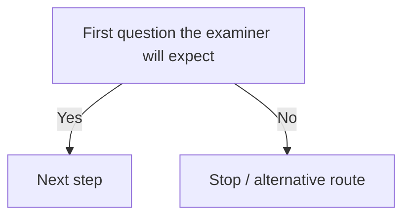

# [Module] — Chapter [N]: [Title]

> **The chapter in one breath (ELI5):** [Two or three sentences a smart teenager would follow.]

---

## [Term 1]

**[Term 1]** — [precise legal definition].
> **ELI5:** [Plain-English explanation with an everyday analogy.]

- **[Case name] [year]** — [What actually happened, in two sentences.] [What the court decided and the ratio.] *Why it matters:* [how it's used in an exam.]

## [Term 2]

**[Term 2]** — [definition].
> **ELI5:** [...]

- **[Case]** — [facts] [ratio] *Why it matters:* [...]

---

## Stand-alone rules (no case attached)

- [Statutory section or rule] — [what it says in plain English].

## Worked example

*[Short hypothetical.]*

1. **[Step 1 of the test]:** [apply it] ✔ / ✘ ([authority])
2. **[Step 2]:** [...]

**Conclusion:** [...]

## Memory hook

[Mnemonic or bizarre visual story for the hardest multi-part test.]
